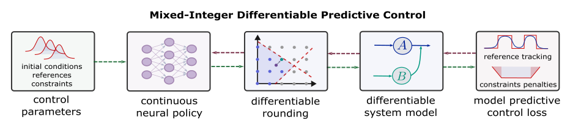
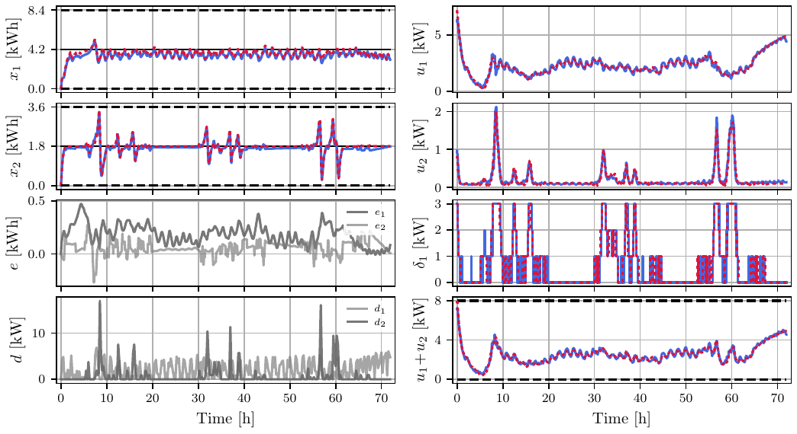
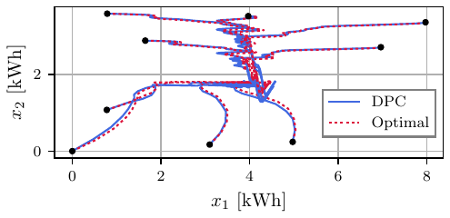

# Learning to Solve Parametric Mixed-Integer Optimal Control Problems via Differentiable Predictive Control

[](https://arxiv.org/abs/2506.19646)

Reference implementation and reproduction scripts for the paper **Learning to Solve Parametric Mixed-Integer Optimal Control Problems via Differentiable Predictive Control**. The method extends [Differentiable Predictive Control](https://www.sciencedirect.com/science/article/pii/S0959152422000981) to systems with mixed-integer decision variables.

 We provide an instructive live Google Colab example code of MI-DPC with a similar problem setup
<a target="_blank" href="https://colab.research.google.com/github/pnnl/neuromancer/blob/master/examples/control/Part_6_mixed_integer_decisions.ipynb"></a>.



> Online mixed-integer optimal control (MI-OCP) requires solving an NP-hard mixed-integer quadratic program (MIQP) at every sampling instant; computational cost grows quickly with problem size (horizon length). **MI-DPC** trains a neural control policy $\pi_\theta$ offline to map parameters $\xi_k = [x_k^\top, d_k^\top, \dots, d_{k+N}^\top]^\top$ directly to continuous and integer control decisions $[u_k^\top, \delta_k^\top]^\top$, constituting an explicit solution and thus avoiding online optimization.

> Training is self-supervised: no optimal trajectory labels are needed. Instead, the MPC objective is minimized by differentiating through an $N$-step rollout of the system dynamics using backpropagation through time. Integer decisions $\delta_k \in \mathbb{Z}$ are enforced with a differentiable rounding (quantization) layer where the gradient is approximated using a differentiable surrogate of the quantization function.

This repository implements MI-DPC with three different rounding strategies and an imitation-learning baseline trained on optimal trajectory labels.

| Approach | Script | Description |
| --- | --- | --- |
| Optimal baseline (MI-MPC) | `_1_CPLEX.py` | Exact MIQP solved online with CPLEX branch-and-bound. |
| MI-DPC — Sigmoid STE | `_2_sigmoid.py` | Nearest-integer rounding; sigmoid straight-through gradient estimation. |
| MI-DPC — Gumbel-Softmax STE | `_3_softmax.py` | Categorical approach; hard one-hot (argmax) forward, soft (softmax) backward. |
| MI-DPC — Learnable threshold | `_4_learnable_threshold.py` | Second network predicts correction and per-variable threshold ([Tang et al., 2025](https://arxiv.org/abs/2410.11061)). |
| Imitation learning | `_6_*.py` + `_7_*.py` | Same network as Sigmoid STE, fitted to MIQP labels. |

## Benchmark problem

### Dynamics 

Second-order LTI thermal system with two heat pumps and a bank of heating rods. Sampling period $T = 300\,\mathrm{s}$, 1873 steps ($\approx$ 6.5 days). Problem desing inspired by (Löhr et al., 2019):

$$x_{k+1} = A x_k + B_\mathrm{u} u_k + B_\delta \delta_k + E d_k,$$

$$
A = \begin{bmatrix} \alpha_1 & \nu \\\\ 0 & \alpha_2 - \nu \end{bmatrix},\quad
B_\mathrm{u} = \begin{bmatrix} b_1 & 0 \\\\ 0 & b_2 \end{bmatrix},\quad
B_\delta = \begin{bmatrix} 0 \\\\ b_3 \end{bmatrix},\quad
E = \begin{bmatrix} -b_4 & 0 \\\\ 0 & -b_5 \end{bmatrix},
$$

with $\alpha_1 = 0.9983$, $\alpha_2 = 0.9966$, $\nu = 0.001$, $b_1 = b_2 = 0.075$, $b_3 = 0.0825$, $b_4 = b_5 = 0.0833$.

* States $x_1, x_2$ [kWh] — tank energies, box-constrained to $[0, 8.4]$ and $[0, 3.6]$.
* Continuous inputs $u_1, u_2$ [kW] — heat pumps, $u_i \ge 0$, $0 \le u_1 + u_2 \le 8$.
* Integer input $\delta_1 \in \{0,1,2,3\}$ [kW] — active 1 kW heating rods in tank $x_2$.
* Disturbances $d_1, d_2$ [kW] — known over the horizon.
* Setpoint $r = [4.2, 1.8]^\top$ kWh; weights $P = Q = I$, $R = \mathrm{diag}(0.5, 0.5)$, $\rho = 0.1$.
* Horizons $N \in \{10, 15, 20, 25, 30, 35, 40\}$.

Heating rods are weighted cheaper than heat pumps so the integer input is exercised frequently.

### Objective

The control objective is defined by a loss function where a control error between state $x$ and respective reference $r$ value is penalized, as well as control effort of both $u$ and $\delta$. Constraints are relaxed with the penalty method:

$$ \min_\theta \mathbb{E}_{\xi_k \sim \mathcal{P}_\xi} \Big[ \lVert x_N - r_N \rVert_P^2 + \sum_{k=0}^{N-1} \lVert x_k - r_k \rVert_Q^2 + \lVert u_k \rVert_R^2 + \lVert \delta_k \rVert_\rho^2 + c_x q(x_k, x_N) + c_u p(u_k, \delta_k) \Big], $$

with $c_x = c_u = 25$. In code: NeuroMANCER `PenaltyLoss` on `variable('X')` and `variable('U')`, penalizing violations, $u \ge 0$, and $0 \le u_1 + u_2 \le 8$ as well as $0\leq x_1 \leq 8.4$ and $0\leq x_2 \leq 3.6$.


## Results

Closed-loop trajectories for $N = 20$: MI-DPC with Sigmoid STE (blue) vs. exact MIQP (dashed red). $e_1$, $e_2$ are state deviations between the two.



Phase plot for $N = 25$.



Table 1 from the paper (20 initial conditions, 1873 steps):

| Approach | Metric | $N=10$ | $N=15$ | $N=20$ | $N=25$ | $N=30$ | $N=40$ |
| --- | --- | ---: | ---: | ---: | ---: | ---: | ---: |
| **MI-DPC**<br>Sigmoid STE | $\ell_\mathrm{mean}$ | 6.82 | 4.60 | 4.19 | 3.95 | 3.89 | 3.85 |
| | RSM | 14.31 % | 4.14 % | 4.37 % | 1.42 % | 1.15 % | – |
| | MIT | 0.0002 s | 0.0002 s | 0.0002 s | 0.0002 s | 0.0002 s | 0.0002 s |
| | NTP | 82 603 | 84 003 | 85 403 | 86 803 | 88 203 | 91 003 |
| | TT | 231.6 s | 347.5 s | 214.4 s | 440.8 s | 410.3 s | 444.1 s |
| **MI-DPC**<br>Softmax STE | $\ell_\mathrm{mean}$ | 6.76 | 4.79 | 4.11 | 3.93 | 3.90 | 3.86 |
| | RSM | 13.56 % | 8.05 % | 2.36 % | 1.11 % | 1.36 % | – |
| | MIT | 0.0002 s | 0.0002 s | 0.0002 s | 0.0002 s | 0.0002 s | 0.0002 s |
| | NTP | 83 026 | 84 426 | 85 826 | 87 226 | 88 626 | 91 426 |
| | TT | 223.3 s | 281.6 s | 373.3 s | 432.7 s | 317.3 s | 393.4 s |
| **MI-DPC**<br>Learnable threshold | $\ell_\mathrm{mean}$ | 6.42 | 4.53 | 4.08 | 3.90 | 3.86 | 3.84 |
| | RSM | 8.96 % | 2.69 % | 1.68 % | 0.45 % | 0.41 % | – |
| | MIT | 0.0004 s | 0.0004 s | 0.0004 s | 0.0004 s | 0.0004 s | 0.0004 s |
| | NTP | 78 191 | 80 091 | 81 991 | 83 891 | 85 791 | 89 591 |
| | TT | 429.9 s | 573.8 s | 664.6 s | 845.7 s | 821.4 s | 1080.9 s |
| **Imitation learning**<br>Sigmoid STE | $\ell_\mathrm{mean}$ | 5.87 | 4.48 | 4.06 | 3.96 | 3.89 | 4.99 |
| | RSM | 0.52 % | 1.52 % | 1.15 % | 1.92 % | 1.27 % | – |
| | MIT | 0.0002 s | 0.0002 s | 0.0002 s | 0.0002 s | 0.0002 s | 0.0002 s |
| | NTP | 82 603 | 84 003 | 85 403 | 86 803 | 88 203 | 91 003 |
| | TT | 1826.9 s | 2335.2 s | 3645.9 s | 4405.6 s | 7053.2 s | 7238.9 s |
| **Optimal** (MIQP) | $\ell_\mathrm{mean}$ | 5.84 | 4.41 | 4.01 | 3.88 | 3.84 | † |
| | MIT | 0.0031 s | 0.0085 s | 0.0421 s | 0.2507 s | 1.3140 s | † |
| | FUP | 0 % | 0 % | 0 % | 0.04 % | 2.44 % | † |

**Metrics:** RSM — relative suboptimality margin vs. MIQP; MIT — mean inference time; NTP — number of trainable parameters; TT — training time (imitation learning includes label generation, capped at 2 h); FUP — fraction of steps where the MIQP solve exceeded 15 s.

† CPLEX did not finish $N=40$ simulations within 20 h; from 100 samples, MIT $\approx$ 14.3 s. Inference timed on one Intel i9-14900KF thread; training on an NVIDIA GeForce RTX 5090.

## Method and implementation

### Rounding strategies

The integer head outputs a relaxed value $y_k^{(\delta)} \in \mathbb{R}^{n_\delta}$. Integrality is enforced by a discrete rounding layer at the output; because rounding is non-differentiable, gradients $\partial \delta / \partial \theta$ are approximated with a **straight-through estimator (STE)**: the forward pass uses the hard discrete value, while the backward pass substitutes a differentiable surrogate (Bengio et al., 2013).

#### Sigmoid STE (`_2_sigmoid.py`)

Nearest-integer rounding is applied in the forward pass:

$$\delta_k = \lfloor y_k^{(\delta)} \rceil, \qquad u_k = y_k^{(u)}.$$

The backward pass replaces the zero gradient of rounding with the derivative of a sigmoid surrogate. With slope $\eta > 1$ and rounding threshold $t = 0.5$,

$$\nabla \delta_k \approx \nabla \sigma\big(\eta\;(y_k^{(\delta)} - \lfloor(y_k^{(\delta)}\rfloor - t)\big)$$

Larger $\eta$ tracks the rounding function more closely but yields steeper gradients. This repository uses $\eta = 10$ and clips $y^{(\delta)}$ to $[-0.49,\,3.49]$ so $\delta \in \{0,1,2,3\}$.

The STE is implemented as a detach trick (no custom autograd function):

```python
def _relaxed_round(x, slope=10.0):
    backward = x - torch.floor(x) - 0.5   # fractional part minus threshold t
    return torch.round(x) + (torch.sigmoid(slope*backward) - torch.sigmoid(slope*backward).detach())
```

**Limitation:** sigmoid STE assumes evenly spaced feasible integers (e.g. $\{0,1,2,3\}$). For uneven sets such as $\{0,1,5\}$, use the categorical Gumbel-Softmax variant below.

#### Gumbel-Softmax STE (`_3_softmax.py`, `utils/softmax.py`)

Integrality is cast as **categorical classification**. For each integer input $j$, the network outputs logits $S_{k|j} = [s_{k|1}, \dots, s_{k|L_j}]^\top$ over $L_j$ admissible values $A_j = [a_1, \dots, a_{L_j}]^\top$. Logits are perturbed with Gumbel $(0,1)$ noise and normalized with temperature $\tau$:

$$\hat{s}_{k|i} = \frac{\exp\big((\log s_{k|i} + g_{k|i})\,\tau^{-1}\big)}{\sum_{m=1}^{L_j} \exp\big((\log s_{k|m} + g_{k|m})\,\tau^{-1}\big)}, \qquad g \sim \mathrm{Gumbel}(0,1).$$

The forward pass selects the arg-max category (hard one-hot $\bar{S}_{k|j}$) and maps it to the integer value:

$$\delta_{k|j} = \bar{S}_{k|j}^\top A_j, \qquad u_k = y_k^{(u)}.$$

Because one-hot encoding is non-differentiable, the backward pass uses the soft probabilities $\hat{S}_{k|j}$ instead (STE):

$$\nabla \delta_{k|j} \approx \nabla\big(\hat{S}_{k|j}^\top A_j\big).$$

Gumbel noise encourages exploration during training; it is disabled at evaluation (`enable_gumbels = False` in `_5_test_models.py`). This repository uses $\tau = 0.5$ and $A = \{0,1,2,3\}$. Unlike sigmoid STE, this formulation supports **arbitrary, unevenly spaced** integer sets.

#### Learnable threshold (`_4_learnable_threshold.py`, `utils/rnd.py`, `utils/ste.py`)

Following Tang et al. (2025), a second network on $(\xi_k, y_k^{(\delta)})$ predicts a correction and thresholds $t_k = \sigma(z_k)$; rounding direction is chosen by comparing the fractional part to $t_k$, with sigmoid STE gradients extended to the learnable thresholds. With `continuous_update=True`, the correction network also refines $u$. Most accurate variant; roughly 2× inference and training time.

### Training data

Sampled offline: $x_{1|0} \sim \mathcal{U}(0, 8.4)$, $x_{2|0} \sim \mathcal{U}(0, 3.6)$, disturbances from fitted distributions ($d_1 \sim 7 \cdot \mathrm{Beta}(0.6, 1.4)$; $d_2$ from a peak generator). Shipped file `training_data/extended_disturbances_60.pt` holds 40 281 windows of length 40; first 24 000 for training, next 4000 for validation. Each horizon uses the first $N$ steps. Test disturbances: `loads_matrix.mat`.

Adam, lr $3 \times 10^{-4}$, batch 2000, up to 1000 epochs (20 warm-up, early stop after 80 without validation improvement), seed 208. Each script trains all seven horizons in one run.

### Evaluation

`_5_test_models.py` rolls out 20 initial conditions (`utils/initial_conditions.py`) over 1873 steps on CPU (`torch.set_num_threads(1)`, GC disabled during timing). MIT = total wall time / $(20 \times 1873)$; $\ell_\mathrm{mean}$ from `PenaltyLoss.calculate_objectives`; RSM = $(\ell_\mathrm{method} - \ell_\mathrm{CPLEX}) / \ell_\mathrm{method}$. Horizons $\{10, 15, 20, 25, 30, 40\}$; CPLEX reference for the first five.

## Requirements

* Python 3.10+
* [PyTorch](https://pytorch.org/) 2.8 (CUDA recommended for training)
* [NeuroMANCER](https://github.com/pnnl/neuromancer) 1.5.6
* NumPy, SciPy, Matplotlib, tqdm
* [CVXPY](https://www.cvxpy.org/) + mixed-integer solver (CPLEX 22.1.2 in the paper; `--solver gurobi` also supported in step 6)
* LaTeX with `pdflatex` for PGF export in `_8_plots.py`

```bash
python -m venv .venv
source .venv/bin/activate
python -m pip install --upgrade pip
pip install torch numpy scipy matplotlib tqdm cvxpy neuromancer==1.5.6
# CPLEX bindings from your IBM installation, e.g.:
pip install cplex docplex
```

CPLEX is not required to train or evaluate learned controllers: reference MIQP trajectories and trained models are included.

## Reproducing the results

Run scripts from the repository root in order. Steps 1 and 3 are expensive; later steps can use committed artefacts.

**1. Optimal MIQP baseline**

```bash
python _1_CPLEX.py -ic 0        # one initial condition, all horizons
./run_1_CPLEX.sh                # all 20 in parallel (cores 10–29)
```

Output: `CPLEX_inference_data/N{N}/cvxpy_cplex_ic{i}.pt`. Tolerances: `mipgap = 1e-16`, single thread, 2 h cap per horizon. Parallel launcher needs 20+ free cores; otherwise loop over `-ic`.

**2. Train MI-DPC policies**

```bash
python _2_sigmoid.py
python _3_softmax.py
python _4_learnable_threshold.py
```

Output: `training_outputs/{sigmoid,softmax,lt}/models/model_*_N{N}.pt` and `training_data_N{N}.pt` (parameter count, training time).

**3. Imitation learning** (optional)

```bash
python _6_imitation_learning_data_generation.py --solver cplex --nsteps 20
./run_7_imitation_learning_data_generation.sh   # all horizons in parallel
python _7_imitation_learning_policy_synthesis.py
```

Up to 24 000 open-loop MIQPs per horizon, 2 h generation budget per horizon.

**4. Evaluate**

```bash
python _5_test_models.py        # or ./run_5_test_models.sh
```

Output: `simulation_data/{sigmoid,softmax,lt,imitation}.pt`; sample log in `test_models.log`.

**5. Plot**

```bash
python _8_plots.py              # -> plots/fig1v2.*, plots/phase_plotv2_large.*
```

`_0_generate_synthetic_disturbance_data.py` documents synthetic disturbance generation. The save call is commented out — regenerating shifts reported numbers.

## Repository layout

```
_0 … _8 *.py              pipeline scripts (execution order)
run_*.sh                  parallel launchers (core-pinned)
utils/                    initial conditions, STE, rounding modules
training_data/            synthetic disturbances (40281, 40, 2)
loads_matrix.mat          test disturbance trajectories
CPLEX_inference_data/     exact MIQP rollouts
imitation_learning_data/  MIQP-labelled datasets
training_outputs/         trained policies and metadata
simulation_data/          closed-loop rollouts and metrics
plots/                    figures (PDF, PGF, PNG previews)
logs/, test_models.log    reference run logs
```

## Citation
If you use this methodology in your work, please cite our work as:
```bibtex
@article{boldocky2025learning,
  title={Learning to solve parametric mixed-integer optimal control problems via differentiable predictive control},
  author={Boldock{\'y}, J{\'a}n and Javan, Shahriar Dadras and Gulan, Martin and M{\"o}nnigmann, Martin and Drgo{\v{n}}a, J{\'a}n},
  journal={arXiv preprint arXiv:2506.19646},
  year={2025}
}
```

## Acknowledgements

Supported by Horizon Europe grant no. 101079342 ([FrontSeat](https://frontseat.stuba.sk/)) and the [Ralph O'Connor Sustainable Energy Institute at Johns Hopkins University](https://energyinstitute.jhu.edu/).

<p align="center">
  
  
  <br>
  
  
  
  <br>
</p>
